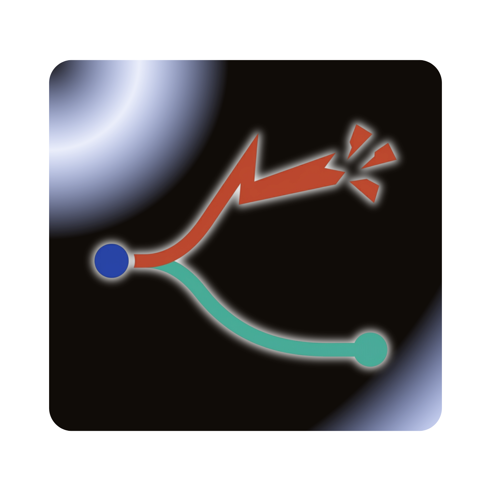

<p align="center">
  
</p>

<h1 align="center">DirePhish</h1>
<p align="center"><em>Clone your org as AI agents. Unleash a threat actor. Watch it cascade.</em></p>

<p align="center">
  <a href="LICENSE"></a>
</p>

DirePhish builds a swarm of AI agents that think and act like your
organization -- your CISO, your SOC analysts, your PR team, your CEO.
Each agent has its own persona, memory, and decision-making logic,
grounded in real data scraped from your company. Then it drops a
threat actor into the mix and simulates how an incident proliferates
across Slack, email, and internal channels, round by round, until
containment or breach.

It doesn't guess what might happen. It runs the scenario dozens of
times with controlled variation -- different personalities under
pressure, different timing, different attacker moves -- and gives you
a probability distribution. "73% contained within 12 hours. 18%
lateral movement succeeded. 9% full regulatory escalation."

The output is an exercise report your board can read and your red team
can act on. A post-mortem for an incident that never happened.

<p align="center">
  <a href="https://youtu.be/9kpxucZRj8g">
    
  </a>
</p>
<p align="center"><sub>67 seconds. Amazon. Supply chain attack. 10 Monte Carlo runs. Zero containment.</sub></p>

- [Architecture & pipeline diagram](docs/ARCHITECTURE.md)
- [Full tech stack](docs/TECH_STACK.md)
- [GCP setup guide](docs/GCP_SETUP.md)
- [ADK migration design](docs/superpowers/specs/2026-05-05-adk-migration-research.md)
- [Google Agent Platform research](docs/superpowers/specs/2026-05-11-google-agent-platform-research.md)

## Built on Google ADK

DirePhish runs on Google's [Agent Development Kit](https://adk.dev). The
simulation core, judge, refinement loop, and threat actor are all
`BaseAgent` / `LlmAgent` instances composed via `SequentialAgent` +
`ParallelAgent`. Worlds (Slack, Email, PagerDuty) are exposed as
[MCP](https://modelcontextprotocol.io) servers. The Containment Judge
is also available as a stand-alone
[A2A](https://a2a-protocol.org) service.

- **Multi-model** — Gemini 3.1 family (Flash Lite / Pro) for the
  defender team and judge via Vertex AI Model Garden; Claude Sonnet
  4.5 for the threat actor via the same registry. Flip
  `THREAT_ACTOR_PROVIDER=claude|gemini` in `.env`, no code change.
- **Cross-process A2A** — the Judge runs in-process by default; flip
  to the cross-process A2A endpoint by setting `A2A_JUDGE_URL`.
- **Eval-driven refinement** — `scripts/refine_prompts.py` runs a
  `LoopAgent` over a 25-case evalset in `backend/tests/evalsets/` and
  promotes the variant that improves the weakest rubric.
  `scripts/eval_report.py` renders the headline business metric.
- **Observability** — OpenTelemetry traces (opt-in via
  `CLOUD_TRACE_ENABLED=true`) export to Cloud Trace. Cost dashboard
  at `GET /api/adk/cost-dashboard/<sim_id>`.
- **Deployment** — Cloud Run for the orchestrator + frontend; Vertex
  AI Agent Engine for the Judge
  (`backend/adk/agent_engine_deploy.py`).

## Quick start

### Prerequisites

- Node.js >= 18
- Python 3.11-3.12
- [uv](https://docs.astral.sh/uv/) package manager
- A Google Cloud project with Firestore enabled -- [setup guide](docs/GCP_SETUP.md)

### Install

```bash
npm run setup:all
```

### Configure

```bash
cp .env.example .env
```

Required keys in `.env`:

- `LLM_API_KEY` -- Google Gemini API key (AI Studio side)
- `GOOGLE_CLOUD_PROJECT` -- your GCP project ID
- `CLOUDFLARE_ACCOUNT_ID` + `CLOUDFLARE_API_TOKEN` -- for web crawling

Required for ADK live mode (Vertex AI Model Garden routing):

- `GOOGLE_GENAI_USE_VERTEXAI=TRUE`
- `GOOGLE_CLOUD_LOCATION=global` (Gemini 3.1 family lives on `global`;
  regional endpoints only carry Gemini 2.5)

Optional ADK knobs (all default sensibly when unset):

- `LLM_MODEL_NAME` -- one-model-everywhere override for Gemini
- `GEMINI_PRO_MODEL_NAME`, `GEMINI_FLASH_MODEL_NAME` -- per-tier overrides
- `CLAUDE_SONNET_MODEL_NAME` / `OPUS` / `HAIKU` -- per-tier overrides
- `THREAT_ACTOR_PROVIDER=gemini|claude` (default `gemini`; flip to
  `claude` once Anthropic models are enabled on your project's
  Vertex Model Garden — see
  `backend/adk/agents/personas/CLAUDE_VERTEX_ENABLEMENT.md`)
- `A2A_JUDGE_URL=http://localhost:8003` -- runs the judge as a
  cross-process A2A service instead of in-process
- `CLOUD_TRACE_ENABLED=true` -- export OpenTelemetry spans to Cloud
  Trace
- `DIREPHISH_FIRESTORE_ENABLED=false` -- disable per-round Firestore
  writes (for CI / local-only runs)

### Create Firestore indexes

```bash
cd backend && bash scripts/create_firestore_indexes.sh
```

Wait for all indexes to show `READY` (`gcloud firestore indexes composite list`).

### Run

The dev workflow is unchanged — `./start.sh` (or `npm run dev`) brings
the backend up on port 5001 and the Next.js frontend on port 3000.
With `portless` aliases, the URLs are:

- Frontend: https://direphish.localhost:1355
- Backend:  https://api.direphish.localhost:1355

```bash
./start.sh           # bare metal (recommended for dev)
./start.sh docker    # Docker dev with hot reload
./start.sh prod      # Docker prod (Gunicorn + Next start)
./start.sh stop      # tear down containers
```

Or via npm:

```bash
npm run dev
```

Open https://direphish.localhost (requires
[portless](https://github.com/nicepkg/portless)) or
http://localhost:3000 without it.

### What changed under the hood (ADK migration)

Same `./start.sh`, same UI flow, same API surface. The difference is
who runs the simulation rounds:

- **Before:** Flask's `/api/crucible/projects/<id>/launch` spawned
  `scripts/run_crucible_simulation.py` (a 1024-line raw OpenAI /
  CAMEL ChatAgent loop).
- **After:** Flask spawns `python -m backend.adk.runner`, the ADK-
  native runner that drives rounds via a `SequentialAgent` over
  pressure → inject → attacker-observation → adversary → defender
  (ParallelAgent over 5 personas) → judge phases. The legacy script
  is preserved as `scripts/run_crucible_simulation_legacy.py` for
  one-line rollback.

Output files (`actions.jsonl`, `summary.json`, `costs.json`,
Firestore episodes + graph) are byte-for-byte compatible with the
legacy contract; the frontend pipeline page renders the new runner's
output without any changes.

### Try the ADK paths

Once `./start.sh` is up, three quick checks:

```bash
# 1. ADK module health + active model strings
curl -sS http://localhost:5001/api/adk/health | jq

# 2. One-round smoke (fake mode — no Vertex calls)
curl -sS -X POST http://localhost:5001/api/adk/smoke \
  -H 'content-type: application/json' \
  -d '{"round_num":1, "mode":"fake", "simulation_id":"smoke-1"}' | jq

# 3. Live-mode smoke (requires Vertex env vars from §Configure)
curl -sS -X POST http://localhost:5001/api/adk/smoke \
  -H 'content-type: application/json' \
  -d '{"round_num":1, "mode":"live", "simulation_id":"live-1"}' | jq
```

For the live war-room UI, point a browser at:

```
https://direphish.localhost:1355/adk-demo/<your-sim-id>
```

This page subscribes to `/api/adk/sse/<sim_id>` and renders each
persona's action as it streams in, plus a live cost ticker pulling
from `/api/adk/cost-dashboard/<sim_id>`.

### Optional: stand-alone A2A Judge service

For the cross-process scoring story (the Judge runs as a separate
agent + AgentCard discoverable at `/.well-known/agent.json`):

```bash
cd backend
uv run uvicorn adk.a2a.judge_service:app --port 8003
```

Then in `.env`: `A2A_JUDGE_URL=http://localhost:8003`. Restart
`./start.sh`; the orchestrator now routes Judge calls to the A2A
endpoint instead of in-process.

### Optional: refinement loop

The Track 2 differentiator — `LoopAgent`-based prompt refinement
against the 25-case ransomware evalset:

```bash
cd backend
RUN_LIVE_VERTEX=1 uv run python scripts/refine_prompts.py \
    --persona ir_lead --rounds 3
```

Results land in `backend/evals/results/<persona>_<timestamp>/`. Use
`scripts/eval_report.py` to render the headline HTML
("containment time reduced from round N to round M").

### Optional: deploy the Judge to Vertex AI Agent Engine

```bash
cd backend
GOOGLE_CLOUD_PROJECT=raxit-ai VERTEX_AGENT_ENGINE_LOCATION=us-central1 \
  uv run python -m adk.agent_engine_deploy
```

Prints the deployed `reasoning_engine` resource name; set
`A2A_JUDGE_URL` to its endpoint to route production scoring through
Agent Engine.

### First simulation

Enter a company URL, review the dossier, select **Test mode**, and launch.
The agents will research the company, generate threat scenarios, and run
a full incident simulation. Your first exercise report lands in about
25 minutes.

## Simulation modes

| Mode | What it does | Iterations | Time | Cost |
|------|-------------|-----------|------|------|
| Test | Validate the full pipeline end-to-end | 3 | ~25 min | ~$1 |
| Quick | Baseline for demos and quick reads | 10 | ~40 min | ~$7 |
| Standard | Client-ready statistical assessment | 50 | ~75 min | ~$35 |
| Deep | Maximum confidence, exhaustive analysis | 100+ | ~2 hr | ~$70+ |

Each iteration reruns the simulation with controlled variation --
temperature jitter, persona perturbation, inject timing shifts, agent
order shuffles -- so the outcome distribution reflects real uncertainty,
not a single lucky narrative. See [Monte Carlo details](docs/ARCHITECTURE.md#monte-carlo-simulation).

## What you get

A 5-view exercise report generated from simulation evidence:

- **Board View** -- KPIs, incident timeline, team performance metrics
- **CISO View** -- threat assessment, top risks, organizational impact
- **Security Team** -- role-by-role performance breakdown
- **Playbook** -- 6-part IR playbook from evidence through recovery
- **Risk Score** -- FAIR methodology with confidence intervals

Plus: outcome probability distributions, decision divergence analysis
(which agent's choice mattered most), and counterfactual branching
(fork any decision, replay the alternate timeline).

## How it works

DirePhish researches your target company, builds a dossier and knowledge
graph, generates threat scenarios mapped to MITRE ATT&CK, then expands
each scenario into a full simulation config -- agents with personas,
communication worlds, timed attack injects, and business pressures. A
live threat actor agent plays against your defenders with asymmetric
information. An arbiter LLM decides when to halt or inject twists.
After simulation, Monte Carlo reruns and counterfactual branching
produce the statistical foundation for the exercise report.

See [Architecture](docs/ARCHITECTURE.md) for the full pipeline diagram.

## Built on

DirePhish is built on [MiroFish](https://github.com/666ghj/MiroFish),
an open-source swarm intelligence engine that constructs parallel digital
worlds populated by thousands of AI agents with independent personalities,
memories, and behavioral logic. DirePhish takes that engine and points it
at cybersecurity -- replacing generic social simulation with incident
response, attack chains, and organizational crisis dynamics.

Simulation engine: [Crucible](https://github.com/raxITlabs/crucible).
Sharpened by [raxIT Labs](https://raxit.ai).

[Full tech stack ->](docs/TECH_STACK.md)

## Links

- [raxIT Labs](https://raxit.ai) -- the team behind DirePhish
- [Crucible](https://github.com/raxITlabs/crucible) -- the simulation engine powering DirePhish
- [MiroFish](https://github.com/666ghj/MiroFish) -- the swarm intelligence engine we built on

<p align="center">
  <a href="https://raxit.ai">Website</a> &middot;
  <a href="https://www.linkedin.com/company/raxit-ai">LinkedIn</a> &middot;
  <a href="https://bsky.app/profile/raxit.ai">Bluesky</a> &middot;
  <a href="https://x.com/raxit_ai">X</a>
</p>

## License

AGPL-3.0 -- see [LICENSE](LICENSE) for details.
